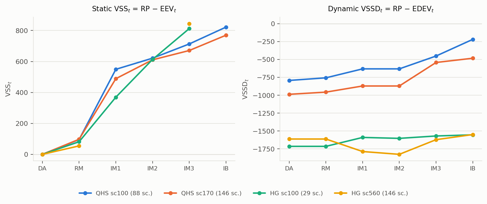

# VSS / VSSD Results: QHS vs HG

Sim `001`, market `DA`, day `2025-10-31`. Four runs compared:

| Label | Branch / dataset | `sc` (raw) | Retained (in-model) scenarios | Results dir |
|---|---|---:|---:|---|
| QHS sc100 | `15min_different_ren` (dif_ren) | 100 | **88** | `mmobec-pyomo/results/..._sc100_15min_different_ren` |
| QHS sc170 | `15min_different_ren` (dif_ren) | 170 | **146** | `mmobec-pyomo/results/..._sc170_15min_different_ren` |
| HG sc100 | `15min_ren_same`/hg-worktree (same_ren) | 100 | **29** | `mmobec-pyomo-hg-worktree/results/..._sc100_15min_same_ren` |
| HG sc560 | `15min_ren_same`/hg-worktree (same_ren) | 560 | **146** | `mmobec-pyomo-hg-worktree/results/..._sc560_15min_same_ren` |

**sc170 (QHS) and sc560 (HG) were deliberately chosen as the matched pair** — both reduce to 146 retained scenarios, making them the intended apples-to-apples comparison point between the two datasets. The two `sc100` runs are *not* matched: the same raw count (100) reduces to very different retained counts under each dataset's own scenario-tree reduction (88 for QHS vs. 29 for HG) — a ~3x gap — so `sc100` should be read as "same generation budget, different outcome," not as a controlled comparison.

All four objectives (`RP`, `EV`, `EDEV_t`, `EEV_t`) are **maximization** objectives (`sense=pyo.maximize` in `ev_subproblem.py`), reported as negative numbers (net cost dominates revenue on this day in every run). `VSS_t = RP - EEV_t` and `VSSD_t = RP - EDEV_t`; standard theory requires both `>= 0` since `RP` is optimal and `EEV_t`/`EDEV_t` are feasible-but-suboptimal policies evaluated under full recourse.

Macro-stage order (`t=1..6`): `DA, RM, IM1, IM2, IM3, IB`.

---

## 1. Raw results

### QHS sc100 (88 retained scenarios)

`RP = -25736.9212`, `EV = -25882.8661`

**Static chain (EEV_t / VSS_t)** — `run_static_vss.py`, single classical-EV fixing source, all 88 real scenarios:

| t | stage | EEV_t | VSS_t | excluded weight |
|---|---|---:|---:|---:|
| 1 | DA | -25736.9212 | 0.0000 | 0.0 |
| 2 | RM | -25832.5796 | 95.6583 | 0.0 |
| 3 | IM1 | -26286.2929 | 549.3717 | 0.0 |
| 4 | IM2 | -26358.2413 | 621.3201 | 0.0 |
| 5 | IM3 | -26450.0803 | 713.1590 | 0.0 |
| 6 | IB | -26558.8469 | 821.9257 | 0.0 |

**Dynamic chain (EDEV_t / VSSD_t)** — `run_vssd.py`, per-group conditional-average fixing:

| t | stage | EDEV_t | VSSD_t | excluded weight |
|---|---|---:|---:|---:|
| 1 | DA | -24943.1221 | -793.7991 | 0.0 |
| 2 | RM | -24979.6076 | -757.3136 | 0.0 |
| 3 | IM1 | -25104.8520 | -632.0692 | 0.0 |
| 4 | IM2 | -25104.8520 | -632.0692 | 0.0 |
| 5 | IM3 | -25284.1520 | -452.7692 | 0.0 |
| 6 | IB | -25516.9708 | **-219.9504** | 0.0 |

`EDEV_2_recourse = -25467.9717`, `VSSD_2_recourse = -268.9495`

---

### QHS sc170 (146 retained scenarios)

`RP = -26860.6482`, `EV = -27007.2635`

**Static chain:**

| t | stage | EEV_t | VSS_t | excluded weight |
|---|---|---:|---:|---:|
| 1 | DA | -26860.6482 | 0.0000 | 0.0 |
| 2 | RM | -26958.0094 | 97.3612 | 0.0 |
| 3 | IM1 | -27349.5052 | 488.8570 | 0.0 |
| 4 | IM2 | -27471.2422 | 610.5939 | 0.0 |
| 5 | IM3 | -27531.4314 | 670.7832 | 0.0 |
| 6 | IB | -27630.3053 | 769.6571 | 0.0 |

**Dynamic chain:**

| t | stage | EDEV_t | VSSD_t | excluded weight |
|---|---|---:|---:|---:|
| 1 | DA | -25873.1615 | -987.4867 | 0.0 |
| 2 | RM | -25903.4659 | -957.1824 | 0.0 |
| 3 | IM1 | -25989.2427 | -871.4055 | 0.0 |
| 4 | IM2 | -25989.2427 | -871.4055 | 0.0 |
| 5 | IM3 | -26317.7728 | -542.8754 | 0.0 |
| 6 | IB | -26377.1411 | **-483.5071** | 0.0 |

`EDEV_2_recourse = -26394.2337`, `VSSD_2_recourse = -466.4146`

---

### HG sc100 (29 retained scenarios)

`RP = -39359.7324`, `EV = -39674.9347`

**Static chain:**

| t | stage | EEV_t | VSS_t | excluded weight |
|---|---|---:|---:|---:|
| 1 | DA | -39359.7324 | 0.0000 | 0.0 |
| 2 | RM | -39441.1979 | 81.4654 | 0.0 |
| 3 | IM1 | -39728.8304 | 369.0979 | 0.0 |
| 4 | IM2 | -39972.7845 | 613.0521 | 0.0 |
| 5 | IM3 | -40172.2271 | 812.4947 | 0.0 |
| 6 | IB | *(infeasible)* | *(undefined)* | **1.0000** |

**Dynamic chain:**

| t | stage | EDEV_t | VSSD_t | excluded weight |
|---|---|---:|---:|---:|
| 1 | DA | -37644.7112 | -1715.0212 | 0.0 |
| 2 | RM | -37644.7113 | -1715.0212 | 0.0 |
| 3 | IM1 | -37769.3883 | -1590.3441 | 0.01 |
| 4 | IM2 | -37756.3858 | -1603.3466 | 0.01 |
| 5 | IM3 | -37789.6894 | -1570.0431 | 0.01 |
| 6 | IB | -37805.6621 | **-1554.0704** | 0.01 |

`EDEV_2_recourse = -37944.3906`, `VSSD_2_recourse = -1415.3419`

---

### HG sc560 (146 retained scenarios)

`RP = -39026.4406`, `EV = -39449.4895`

**Static chain:**

| t | stage | EEV_t | VSS_t | excluded weight |
|---|---|---:|---:|---:|
| 1 | DA | -39026.4406 | 0.0000 | 0.0 |
| 2 | RM | -39081.0110 | 54.5703 | 0.0 |
| 3 | IM1 | *(infeasible)* | *(undefined)* | **1.0000** |
| 4 | IM2 | *(infeasible)* | *(undefined)* | **1.0000** |
| 5 | IM3 | -39870.9435 | 844.5028 | 0.0 |
| 6 | IB | *(infeasible)* | *(undefined)* | **1.0000** |

**Dynamic chain:**

| t | stage | EDEV_t | VSSD_t | excluded weight |
|---|---|---:|---:|---:|
| 1 | DA | -37413.8071 | -1612.6335 | 0.0 |
| 2 | RM | -37413.8071 | -1612.6335 | 0.0 |
| 3 | IM1 | -37239.0116 | -1787.4290 | 0.0500 |
| 4 | IM2 | -37199.8094 | -1826.6313 | 0.0982 |
| 5 | IM3 | -37404.7086 | -1621.7320 | 0.0982 |
| 6 | IB | -37476.3462 | **-1550.0944** | 0.1000 |

`EDEV_2_recourse = -37834.4869`, `VSSD_2_recourse = -1191.9537`

---

## 2. Cross-run comparison

*Gaps in the HG lines (`IM1`/`IM2`/`IB` on the static panel) are genuine — those stages are 100% infeasible (undefined `VSS_t`), not interpolated across.*

### RP / EV baselines

| Run | RP | EV | EV − RP (cost of ignoring uncertainty entirely) |
|---|---:|---:|---:|
| QHS sc100 | -25736.92 | -25882.87 | -145.94 |
| QHS sc170 | -26860.65 | -27007.26 | -146.62 |
| HG sc100 | -39359.73 | -39674.93 | -315.20 |
| HG sc560 | -39026.44 | -39449.49 | -423.05 |

### Final-stage VSS / VSSD (where defined)

| Run | VSS_6 (IB, static) | VSSD_6 (IB, dynamic) |
|---|---:|---:|
| QHS sc100 | 821.93 | -219.95 |
| QHS sc170 | 769.66 | -483.51 |
| HG sc100 | *undefined (100% infeasible)* | -1554.07 |
| HG sc560 | *undefined (100% infeasible)* | -1550.09 |

---

## 3. Insights

### 3.1 The static (EEV_t) chain is textbook-clean in QHS, structurally broken in HG

Every QHS `VSS_t` value across both `sc100` and `sc170` is non-negative, monotonically increasing in `t`, and `excluded_infeasible_weight` is **exactly 0.0 at every single stage** — the theoretical guarantee (`VSS_t >= 0`, monotone in the amount of information fixed) holds perfectly, with no scenario ever excluded as infeasible.

HG's static chain, by contrast, hits **100% infeasibility** (`excluded_infeasible_weight = 1.0`) at:
- `sc100`: stage 6 (IB) only
- `sc560`: stages 3, 4, **and** 6 (IM1, IM2, IB) — half the chain

This isn't scenario-specific bad luck (a few unlucky scenarios excluded one at a time) — the round-0 Gurobi IIS in each failing case implicates essentially *all* retained scenarios simultaneously (confirmed directly from the `.ilp` certificates for `sc560`'s IM1/IM2/IB rounds: `IM_link_posneg` and `IM_bounds_3/4_relaxed` dominate the infeasible subsystem at ~14,000–42,000 rows each). The root cause: `EEV_t`'s fixing source is a *single* classical-EV solve (one deterministic average across the *entire* scenario set), broadcast identically to every real scenario. Once `eDA` is fixed this way, `_cap20()` in `model_builder.py` derives the intraday bound `cap = maxTIM * fixed_eDA` — a scenario-independent number. The existing `relax_im_bounds_for_fixed_da()` fix only rescues the case where that fixed DA position is *exactly* ~0; it does nothing when the classical average is small-but-nonzero, which is enough to make `cap` too tight for the real dispersion across scenarios once several stages' worth of decisions are pinned simultaneously. HG's `same_ren` data appears far more prone to this than QHS's `dif_ren` data at the same nominal reduction target (146 scenarios) — a genuine dataset-level asymmetry worth flagging, not just a scenario-count artifact.

### 3.2 The dynamic (EDEV_t) chain is negative at the final stage in *all four* runs — Prop. 5 keeps failing

`VSSD_6` is negative in every run:

| QHS sc100 | QHS sc170 | HG sc100 | HG sc560 |
|---:|---:|---:|---:|
| -219.95 | -483.51 | -1554.07 | -1550.09 |

This is the known open anomaly (`RP >= EDEV_T` should hold by Proposition 5, but doesn't) — not new to this batch of runs, but now confirmed across two independent datasets and four scenario counts, so it's not an artifact of one particular instance. Two patterns stand out:
- **Magnitude scales with dataset, not scenario count**: QHS's violation is roughly -220 to -480 regardless of whether it's `sc100` or `sc170`; HG's is roughly -1550 to -1554 regardless of `sc100` or `sc560`. The violation size looks tied to *which dataset* (same_ren vs dif_ren), not to how many scenarios are retained.
- **QHS's own two counts (sc100 → -219.95, sc170 → -483.51) more than double** even though the underlying mechanism should, in principle, converge as more scenarios are retained — the opposite of what you'd expect if this were just discretization noise shrinking with sample size.

### 3.3 Monotonicity of VSSD_t: clean in QHS, visibly broken in HG — and the break lines up exactly with infeasibility exclusion

Looking at the full `VSSD_t` trajectories (t=1..6):

- **QHS sc100**: -793.80 → -757.31 → -632.07 → -632.07 → -452.77 → -219.95 — **strictly, monotonically improving** at every step.
- **QHS sc170**: -987.49 → -957.18 → -871.41 → -871.41 → -542.88 → -483.51 — **also strictly monotonic.**
- **HG sc100**: -1715.02 → -1715.02 → -1590.34 → -1603.35 → -1570.04 → -1554.07 — improving overall, but with a small **dip at t=4** (gets worse from t=3 to t=4) before recovering. Coincides with `excluded_weight` turning on (0 → 0.01) starting exactly at t=3.
- **HG sc560**: -1612.63 → -1612.63 → -1787.43 → -1826.63 → -1621.73 → -1550.09 — a **much sharper dip** at t=3/t=4, bottoming out well below the starting value, before recovering strongly at t=5/t=6. Again coincides exactly with `excluded_weight` jumping from 0 to 0.05 (t=3) to 0.0982 (t=4).

QHS never excludes a single scenario in its dynamic chain (`excluded_weight = 0.0` at every stage, both runs) and never violates monotonicity. HG excludes scenarios (via IIS-based renormalization, Definition 3's remedy) exactly at the stages where monotonicity breaks. This is a direct empirical confirmation of the previously-suspected mechanism: renormalizing survivor weights after excluding infeasible scenarios changes *which* population `EDEV_t` is being evaluated against from one stage to the next, and that's enough to break the monotone-decrease property that only holds when every stage is evaluated against the same fixed population.

### 3.4 Scale gap between datasets

HG's baseline objectives (`RP ≈ -39,000`) sit roughly 45–50% more negative than QHS's (`RP ≈ -26,000` to `-27,000`) across every comparable run. `EV - RP` (the cost of ignoring uncertainty completely) is also consistently larger in HG (-315 to -423) than QHS (-146 either count) — so both the baseline cost level and the return to using stochastic information at all are structurally larger in the `same_ren` (HG) dataset than in `dif_ren` (QHS), independent of scenario count. Combined with 3.1, HG looks like the "harder" instance family along more than one axis at once — bigger baseline costs, bigger value-of-stochastic-solution, and much more prone to the intraday-bound infeasibility.

### 3.5 `sc100`'s retained-scenario gap (88 vs 29) limits how much weight the sc100 comparison can carry

Because `sc100` reduces to 88 scenarios under QHS but only 29 under HG, any cross-dataset difference observed at `sc100` (e.g., HG's static chain already failing at IB while QHS's doesn't fail at all) is confounded with "HG had 3x fewer scenarios to reconcile." The `sc170`/`sc560` pair (both 146 retained) is the only comparison in this set that isolates the dataset effect from the scenario-count effect — and it still shows the same qualitative pattern (HG static chain far more infeasibility-prone, HG VSSD_6 far more negative), which is why 3.1/3.2's conclusions are stated as dataset-level rather than scenario-count-level effects.

---

## 4. Known open items this data reinforces

- **`VSS_t`/`VSSD_t` infeasibility under the `_cap20()` DA-branch cap** — confirmed here as the dominant failure mode in HG's static chain (both `sc100` and `sc560`); the existing `D <= EPS` fallback in `relax_im_bounds_for_fixed_da()` doesn't cover the "small but nonzero fixed DA, still too tight a cap" case that this data exposes. Not yet fixed.
- **`VSSD >= 0` (Proposition 5) violation** — confirmed at the final stage in all four runs here, with violation magnitude that tracks dataset (same_ren vs dif_ren) rather than scenario count. Still an open, unresolved investigation.
